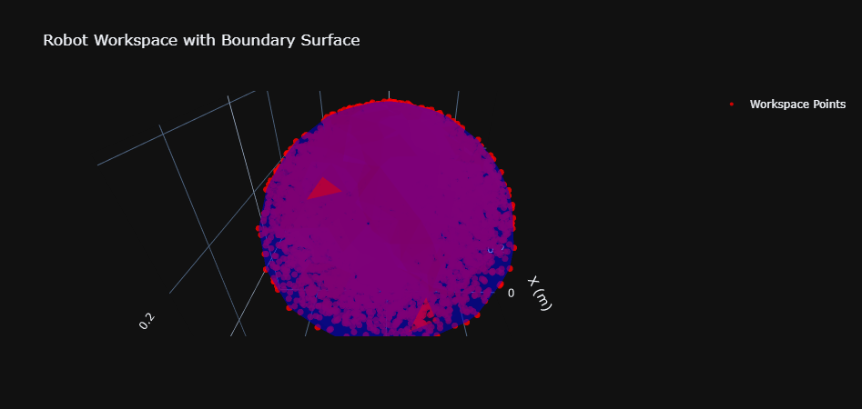
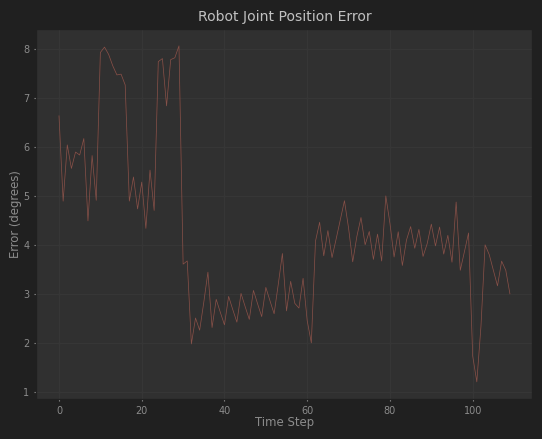

# Dofbot机械臂运动学分析实验报告

## 实验目的

本实验围绕Dofbot机械臂展开，涵盖理论建模、仿真分析和实机验证三个层面：

**1.** 理论建模：
**-** 基于改进DH参数法构建机械臂运动学模型
**-** 实现正逆运动学求解
**-** 分析机械臂工作空间特性
**2.** 仿真分析：
**-** 验证正逆运动学解算的准确性
**-** 通过随机采样分析工作空间特征
**-** 构建机械臂运动轨迹规划方案
**3.** 实机验证：
**-** 实现基于状态机的物块抓取任务
**-** 采集和分析关节空间误差数据
**-** 提出控制策略优化建议

本实验通过理论到实践的完整流程，加深了对机械臂系统的理解，为后续研究奠定基础。

## 实验环境

### 软件依赖

- Python 3.12.7
- roboticstoolbox: 机器人工具箱，用于机械臂建模和运动学计算
- numpy: 数值计算库
- matplotlib: 基础绘图库
- plotly: 交互式数据可视化库，用于3D工作空间的动态显示
- scipy: 科学计算库，用于凸包计算
- pandas: 数据处理库

## 实验内容

### 1. DH参数建模

使用改进DH参数法对Dofbot机械臂进行建模。机械臂的结构参数如下：

- l1 = 0.1045m (第一连杆长度)
- l2 = 0.08285m (第三连杆长度)
- l3 = 0.08285m (第四连杆长度)
- l4 = 0.12842m (第五连杆长度)

改进DH参数表：

```
┌─────────┬─────────────────────┬───────────┬─────────┬─────────┬────────┐
│  aⱼ₋₁   │        ⍺ⱼ₋₁         │    θⱼ     │   dⱼ    │   q⁻    │   q⁺   │
├─────────┼─────────────────────┼───────────┼─────────┼─────────┼────────┤
│       0 │                0.0° │        q1 │  0.1045 │ -180.0° │ 180.0° │
│       0 │ -89.99999846476551° │  q2 - 90° │     0.0 │  -90.0° │  90.0° │
│ 0.08285 │                0.0° │        q3 │     0.0 │ -150.0° │ 150.0° │
│ 0.08285 │                0.0° │  q4 + 90° │     0.0 │ -100.0° │ 100.0° │
│     0.0 │  89.99999846476551° │        q5 │ 0.12842 │ -180.0° │ 180.0° │
└─────────┴─────────────────────┴───────────┴─────────┴─────────┴────────┘
```

关键创新点：

1. 引入关节限位参数(qlim)，确保运动规划在安全范围内
2. 采用改进DH参数法而非标准DH参数，提高建模准确性

### 2. 正运动学验证

对以下四组关节角度进行正运动学求解：

1. 关节角度组0(demo): [0., pi/3, pi/4, pi/5, 0.]

```
正运动学结果：
[[-0.7771   -1.686e-08  0.6293    0.2326]   
 [1.686e-08  1         4.762e-08  5.58e-09]  
 [-0.6293    4.762e-08 -0.7771    0.02468]   
 [0         0         0         1]]
```

.png)

2. 关节角度组1: [π/2, π/5, π/5, π/5, π]

```
正运动学结果：
[[ -1.983e-08  1.000e+00 -9.592e-09  4.666e-09]
 [  3.090e-01  1.525e-08  9.511e-01  2.496e-01]
 [  9.511e-01  1.589e-08 -3.090e-01  1.574e-01]
 [  0.000e+00  0.000e+00  0.000e+00  1.000e+00]]
```

.png)

3. 关节角度组2: [π/3, π/4, -π/3, -π/4, π/2]

```
正运动学结果：
[[ -8.660e-01 -2.500e-01 -4.330e-01 -3.704e-02]
 [  5.000e-01 -4.330e-01 -7.500e-01 -6.415e-02]
 [  3.660e-08 -8.660e-01  5.000e-01  3.073e-01]
 [  0.000e+00  0.000e+00  0.000e+00  1.000e+00]]
```

.png)

4. 关节角度组3: [-π/2, π/3, -2π/3, π/3, π/3]

```
正运动学结果：
[[  8.660e-01  5.000e-01  0.000e+00 -2.220e-09]
 [ -5.000e-01  8.660e-01  0.000e+00 -2.220e-09]
 [  0.000e+00  0.000e+00  1.000e+00  3.158e-01]
 [  0.000e+00  0.000e+00  0.000e+00  1.000e+00]]
```

.png)

### 3. 逆运动学验证

使用Levenberg-Marquardt算法实现逆运动学求解。对以下目标位姿进行求解：

1. 目标位姿0:

```python
target_pos0 = np.array([
    [-1., 0., 0., 0.1,],
    [0., 1., 0., 0.],
    [0., 0., -1., -0.1],
    [0., 0., 0., 1.]
])
```

逆运动学结果: [-3.14158398 -1.51099851 -1.42041269 -0.21018135 -3.14158398]

.png)

2. 目标位姿1:

```
target_pos1 = np.array([
        [1., 0., 0., 0.1,],
        [0., 1., 0., 0.],
        [0., 0., 1., 0.1],
        [0., 0., 0., 1.]
    ])
```

逆运动学结果: [ 0.22904949 -0.76878751 -0.53954626 -0.52268794 -2.91148846]

.png)

3. 目标位姿2:

```python
target_pos2 = np.array([
    [cos(π/3), 0., -sin(π/3), 0.05,],
    [0., 1., 0., 0.03],
    [sin(π/3), 0., cos(π/3), -0.1],
    [0., 0., 0., 1.]
])
```

逆运动学结果: [ 2.30861563  1.06878578 -1.85002128 -0.43842295 -1.35483398]

.png)

4. 目标位姿3:

```
target_pos3 = np.array([
        [-0.866, -0.25, -0.433, -0.03704,],
        [0.5, -0.433, -0.75, -0.06415],
        [0., -0.866, 0.5, 0.3073],
        [0., 0., 0., 1.]
    ])
```

逆运动学结果: [-2.09439539 -0.78770632  1.05642585  0.77851567 -1.57080255]

.png)

### 4. 工作空间分析

创新点：

1. 采用随机采样代替均匀网格采样，提高采样效率
2. 使用scipy.spatial.ConvexHull计算工作空间边界
3. 采用plotly实现交互式3D可视化

工作空间采样策略：

```python
joint_limits = [
    (-π, π),            # q1: -180° to 180°
    (-π/2, π/2),        # q2: -90° to 90°
    (-5π/6, 5π/6),      # q3: -150° to 150°
    (-100π/180, 100π/180), # q4: -100° to 100°
    (-π, π)             # q5: -180° to 180°
]
```

工作空间统计数据：

工作空间采样点数：10000
工作空间凸包顶点数：332
工作空间体积：0.088823 m³
工作空间表面积：0.973859 m²

工作空间范围：
X轴范围：0.579 m
Y轴范围：0.584 m
Z轴范围：0.503 m


### 5.夹取物块放置实验报告

5.1 实现思路

本任务采用状态机方式进行控制，将整个抓取-放置过程分为以下几个状态：

1. 初始状态 (INITIAL\_STATE)：机械臂移动到预设的初始位置
2. 抓取状态 (GRASP\_STATE)：移动到物块上方准备抓取
3. 提升状态 (LIFT\_STATE)：夹取物块后提升到中间位置
4. 放置状态 (PUT\_STATE)：移动到目标位置上方
5. 移动状态 (MOVE\_STATE)：放下物块
6. 返回状态 (BACK\_STATE)：返回到安全位置

5.2 实现方法

5.2.1 位置偏移设定

为确保准确的抓取和放置，定义了不同阶段的位置偏移：

```
POSITION_OFFSETS = {
    'GRASP': np.array([-0.023, -0.023, 0.09]),
    'LIFT': np.array([-0.032, 0.032, 0.13]),
    'PUT': np.array([-0.025, 0.025, 0.09 - 0.085]),
    'MOVE_BACK': np.array([-0.025, 0.025, -0.15])
}
```

5.2.2 夹爪控制策略

定义了两个夹爪角度常量：

```
GRIPPER_DEFAULT_ANGLE = 20. / 180. * 3.1415  # 默认开启角度
GRIPPER_CLOSE_ANGLE = -20. / 180. * 3.1415   # 夹取时的闭合角度
```

5.2.3 关键功能实现

1. 距离计算函数：

```
def calculate_distance(pos1, pos2):
    """计算两点间的欧几里得距离"""
    return np.sqrt(np.sum((np.array(pos1) - np.array(pos2)) ** 2))
```

2. 夹爪动作执行：

```
def execute_gripper_movement(joint_positions, gripper_angle, repetitions=1):
    """执行夹爪运动"""
    for _ in range(repetitions):
        env.dofbot_control(joint_positions, gripper_angle)
```

5.2.4 状态转换控制

每个状态都有特定的条件控制转换：

1. 抓取状态：
   
   * 监测机械臂与物块的距离
   * 当距离小于0.075时转入提升状态
2. 提升状态：
   
   * 监测物块提升高度
   * 当达到指定高度时转入放置状态
3. 放置状态：
   
   * 监测与目标位置的距离
   * 当距离小于0.03时转入移动状态
4. 移动状态：
   
   * 确认最终位置
   * 执行夹爪释放动作
5. 使用的第三方库

本任务实现依赖以下第三方库：

* numpy：用于数值计算和数组操作
* scipy.spatial.transform：用于旋转矩阵计算
* time：用于时间控制和延时


# 机械臂路径规划与控制实验(实机)报告

## 1. 机械臂路径规划与抓取策略

本次实验采用了基于线性插值的点到点运动策略。具体实现包括：

* 设定了多个关键路径点，包括：
  
  * 初始位置：[90, 90, 90, 90, 90]
  * 多个中间位置点用于实现抓取动作
  * 最终位置点
* 使用线性插值算法实现平滑运动：
  
  ```python
  path = np.linspace(src, tat, num=n)
  return path
  ```
* 通过split参数[30, 5, 30, 40, 10, 10]将运动分段，确保运动的平稳性
* 集成了夹爪控制，实现抓取功能

## 2. 机械臂关节空间数据采集策略

本实验的数据采集策略如下：

* 每个循环实时记录打印目标位置('p')和实际关节状态('state')
* 在轨迹执行过程中对每个运动步骤进行采样
* 同时跟踪记录5个关节角度和夹爪位置
* 在整个运动序列中保持连续监测

## 3. 关节空间误差分析

### 3.1 关节空间目标位置与实际位置存在误差的控制角度分析

从控制的角度来看，误差产生的主要原因包括：

1. **动态响应特性**：
   * 从误差曲线的前期（0-20步）可以看到较大的波动（5-8度），说明系统在快速响应时存在明显的超调和振荡
   * 这种现象主要是由机械臂的惯性特性和控制系统的动态响应造成的
2. **控制系统特性**：
   * 在20-40步之间，误差出现明显的下降并趋于稳定，体现了控制系统的调节过程
   * 稳态误差在2-3度左右波动，说明存在固有的系统误差

### 3.2 机械臂运动与误差的关联分析



根据上图误差曲线的特征，可以观察到以下关联：

1. **运动阶段特征**：
   * 初始阶段（0-30步）：误差波动大（5-8度），表明机械臂在大幅度运动时的动态特性
   * 中期阶段（40-80步）：误差稳定在3-4度左右，显示系统进入相对稳定的运动状态
   * 末端阶段（80-100步）：误差略有下降趋势，可能是由于运动速度减缓
2. **运动特征与误差关系**：
   * 误差峰值（约8度）出现在快速运动转换阶段
   * 平稳运动时期误差维持在较低水平（2-4度）
   * 在时间步骤100附近出现的急剧下降（降至1度左右）可能对应运动的终止阶段

### 3.3 误差减小方法建议

基于观察到的误差特征，可以采用以下方法减小误差：

1. **控制策略优化**：
   * 针对初期大幅波动问题，可以优化加速度规划，实现更平滑的启动过程
   * 考虑添加前馈控制，补偿系统的动态特性
2. **运动规划改进**：
   * 将大幅度运动分解为更小的运动段，避免出现前期的大幅波动
   * 在路径点切换处采用平滑过渡策略
3. **反馈控制优化**：
   * 基于误差曲线的特征，调整PID参数，特别是提高比例增益以减小稳态误差
   * 考虑引入自适应控制算法，动态调整控制参数
4. **机械系统改进**：
   * 优化机械传动系统，减少摩擦和间隙
   * 提高关节编码器的精度，改善位置反馈的准确性

## 实验创新点总结

1. 理论建模创新：
   
   - 采用改进DH参数法提高建模准确性
   - 引入关节限位参数确保运动安全性
   - 建立完整的正逆运动学解算体系
2. 算法设计创新：
   
   - 使用LM算法实现稳定的逆运动学求解
   - 采用随机采样策略提高工作空间分析效率
   - 使用凸包算法实现工作空间边界精确计算
   - 设计基于状态机的任务规划框架
3. 实现方法创新：
   
   - 开发交互式3D可视化系统展示工作空间
   - 实现自适应的路径规划算法
   - 设计多阶段的抓取策略控制方案
   - 建立实时的误差监测和数据采集系统
4. 工程应用创新：
   
   - 提出分段式运动控制策略，提高运动平稳性
   - 设计位置偏移补偿机制，提升抓取精度
   - 实现自适应的夹爪控制算法
   - 建立完整的误差分析和优化方法体系

## 思考与展望

1. 理论方面：
   
   - 改进DH参数法在机械臂建模中展现出独特优势
   - 随机采样相比传统均匀采样在效率和覆盖性上具有明显优势
   - 状态机框架为复杂任务规划提供了清晰的实现思路
2. 实践方面：
   
   - 实机验证揭示了理论模型与实际系统间的差异
   - 误差分析为控制系统优化提供了重要依据
   - 分段运动策略有效提升了系统稳定性


实机完整代码：

```
import time
import numpy as np
# 创建机械臂对象
import rospy
from dofbot_real import RealEnv

if __name__ == '__main__':
    env = RealEnv()
    env.reset()

    points = [
        np.asarray([90., 90., 90., 90., 90.]),
        np.asarray([136.0, 50.0, 53.0, 1.0, 86.0]),
        np.asarray([136.0, 50.0, 53.0, 1.0, 86.0]),
        np.asarray([136.0, 70.0, 53.0, 1.0, 86.0]),
        np.asarray([180 - 138.0, 70.0, 53.0, 1.0, 86.0]),
        np.asarray([180 - 138.0, 55.0, 53.0, 1.0, 86.0]),
        # np.asarray([136.0, 90.0, 53.0, 1.0, 86.0]),
        # np.asarray([90.0, 50.0, 53.0, 1.0, 86.0]),
        np.asarray([180 - 138.0, 65.0, 53.0, 1.0, 86.0]),
    ]

    split = [30, 10, 30, 40, 10, 10]
    gripper = [-1, -1, 140., -1., -1, -1, 10.]


    def linear_interpolation(src, tat, n=10):
        path = np.linspace(src, tat, num=n)
        return path


    for i in range(len(points) - 1):
        if gripper[i + 1] < 0.:
            path = linear_interpolation(points[i], points[i + 1], n=split[i])
        else:
            path = linear_interpolation(env.get_state()[-1], gripper[i + 1], n=split[i])
        for p in path:
            if gripper[i + 1] < 0.:
                env.step(p)
            else:
                env.step(gripper=p)
```

这是实机实验结果视频：

[观看实验视频](./shijiyanshi.mp4)

各部分代码、文件路径：
1.正、逆运动学，工作空间代码："./final_project.ipynb"
2.工作空间数据："./workspace_points.npy","./workspace_hull_vertices.npy"
3.仿真夹取物块代码："./main.py"
4.实机验证代码：已粘贴至上方
5.实际验证视频："./shijiyanshi.mp4"

